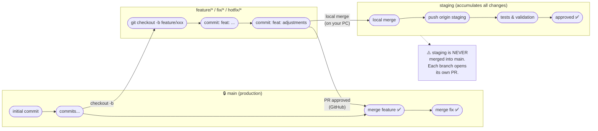

# indicateur_impact

This is a [Next.js](https://nextjs.org) project bootstrapped with [`create-next-app`](https://github.com/vercel/next.js/tree/canary/packages/create-next-app).

## Getting Started

First, run the development server:

```bash
npm run dev
# or
yarn dev
# or
pnpm dev
# or
bun dev
```

Open [http://localhost:3000](http://localhost:3000) with your browser to see the result.

You can start editing the page by modifying `app/page.js`. The page auto-updates as you edit the file.

This project uses [`next/font`](https://nextjs.org/docs/app/building-your-application/optimizing/fonts) to automatically optimize and load [Geist](https://vercel.com/font), a new font family for Vercel.

## Learn More

To learn more about Next.js, take a look at the following resources:

- [Next.js Documentation](https://nextjs.org/docs) - learn about Next.js features and API.
- [Learn Next.js](https://nextjs.org/learn) - an interactive Next.js tutorial.

You can check out [the Next.js GitHub repository](https://github.com/vercel/next.js) - your feedback and contributions are welcome!

## Deploy on Vercel

The easiest way to deploy your Next.js app is to use the [Vercel Platform](https://vercel.com/new?utm_medium=default-template&filter=next.js&utm_source=create-next-app&utm_campaign=create-next-app-readme) from the creators of Next.js.

Check out our [Next.js deployment documentation](https://nextjs.org/docs/app/building-your-application/deploying) for more details.

---

## Git Workflow

This project follows a workflow based on `main` as the source of truth, with a `staging` branch for testing and integration before the final merge.

### Main branches

| Branch    | Purpose                                                     |
| --------- | ----------------------------------------------------------- |
| `main`    | Production. Always stable. Only receives approved PRs.      |
| `staging` | Testing and integration. Merged locally before opening PR.  |

### Branch naming conventions

Every working branch is created from `main` with a descriptive prefix:

| Prefix       | Use                                        |
| ------------ | ------------------------------------------ |
| `feature/*`  | New functionality                          |
| `fix/*`      | Non-urgent bug fix                         |
| `hotfix/*`   | Urgent production fix                      |
| `chore/*`    | Maintenance tasks, dependencies            |
| `refactor/*` | Refactoring without logic changes          |
| `docs/*`     | Documentation changes                      |

### Workflow diagram



### Step-by-step flow

```text
1. Create branch from main
   git checkout main && git pull origin main
   git checkout -b feature/my-new-feature

2. Develop and commit
   git add .
   git commit -m "feat: description of change"

3. Test on staging (local merge)
   git checkout staging
   git merge feature/my-new-feature
   git push origin staging
   → Test on the staging environment

4. Open PR to main (on GitHub)
   → Code review and approval

5. Merge to main (via GitHub PR)
   → Working branch can be deleted

6. Daily routine (at the start of each day)
   git checkout main && git pull origin main
   git checkout feature/my-branch && git rebase main
```

### Simplified visual flow

```text
       main              feature/xxx                  staging
        │                                     (accumulates all changes)
        │
        ├──(checkout -b)──►│
        │                  │
        │                  ▼ commit
        │                  │
        │                  ▼ commit
        │                  │
        │                  ├──(local merge)──────────►│
        │                  │                          ▼ push origin staging
        │                  │                          │  (visible to everyone)
        │                  │                          ▼ tests & validation
        │                  │                          │
        │                  │                          ▼ approved ✅
        │                  │
        ◄──(PR approved)───┤
        │                  ✕ (branch deleted)
        ▼ merge into main

  ⚠️  staging is NEVER merged directly into main.
      Each branch opens its own PR because different
      features may be ready at different times.
```

### Daily routine

Before starting work each day, sync your branch with the latest changes from `main`:

```bash
# 1. Fetch the latest main
git checkout main
git pull origin main

# 2. Switch back to your working branch
git checkout feature/my-feature

# 3. Rebase from main to avoid future conflicts
git rebase main
```

```text
   ☁️ origin/main          main local             feature/xxx
        │                     │
   (commits from others        │
    since yesterday)           │
        │                     │
        ├──(git pull)─────────►│
        │                     │
        │                     ├──(checkout feature/xxx)──►│
        │                     │                           │
        │                     │                           ▼ git rebase main
        │                     │                           │  (brings in the new
        │                     │                           │   commits from main)
        │                     │                           │
        │                     │                           ▼ branch up to date ✅
        │                     │                           │
        │                     │                           ▼ continue working...
```

---

## Git Hooks

This project includes shared git hooks in the `.githooks/` folder. They are automatically configured when you install dependencies.

```bash
npm install   # runs "prepare" → git config core.hooksPath .githooks
```

### Available hooks

#### `pre-commit` — blocks `console.log`

Scans staged `.js/.jsx/.ts/.tsx` files before each commit. If `console.log` statements are found, it offers to remove them automatically.

```text
❌ console.log statements found in the following files:
   src/app/page.js:12:  console.log("debug")

Remove them automatically? (y/N):
```

#### `pre-push` — enforces branch naming

Blocks any push from a branch that does not follow the naming convention.

| Prefix | Use |
| --- | --- |
| `feature/<name>` | New functionality |
| `fix/<name>` | Bug fix |
| `hotfix/<name>` | Urgent production fix |
| `chore/<name>` | Maintenance tasks |
| `docs/<name>` | Documentation |
| `refactor/<name>` | Refactoring |

Base branches (`main`, `staging`, `develop`) are always allowed.

```text
❌ Branch name 'my-branch' does not follow the naming convention.
⛔ Push cancelled. To fix it:

   1. Rename the local branch:
      git branch -m my-branch feature/<new-name>

   2. If already pushed to remote, delete it there and push the renamed one:
      git push origin --delete my-branch
      git push -u origin feature/<new-name>
```

> If you had an open PR pointing to the old branch name, GitHub will prompt you to update it automatically.
